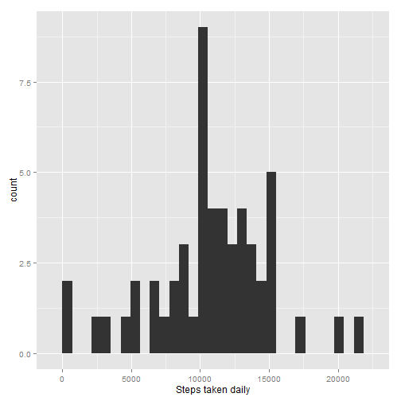
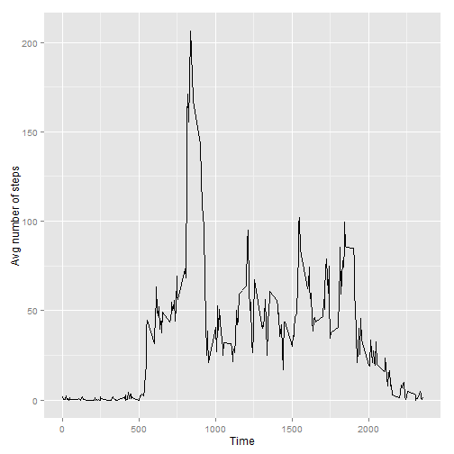
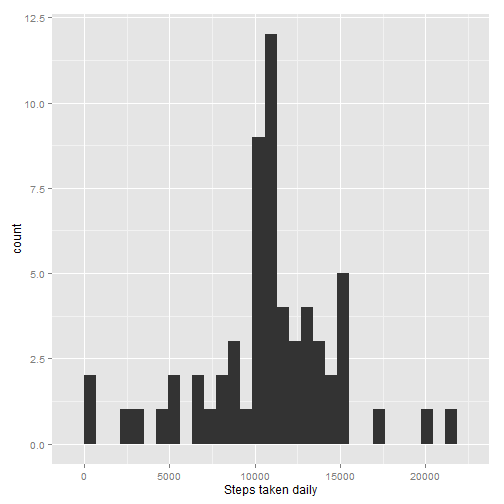
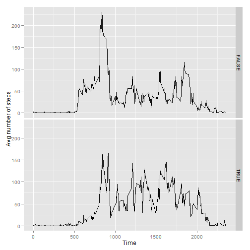

First we need to load the data. Let's look at the first few lines.

```r
activity <- read.csv('activity.csv')
head(activity)
```

```
##   steps       date interval
## 1    NA 2012-10-01        0
## 2    NA 2012-10-01        5
## 3    NA 2012-10-01       10
## 4    NA 2012-10-01       15
## 5    NA 2012-10-01       20
## 6    NA 2012-10-01       25
```


Now we want to sum up the total number of steps taken each day.

```r
activitySum <- aggregate(activity$steps, FUN = sum, by = list(activity$date))
```


What is the mean total number of steps taken per day?

```r
library(ggplot2)
qplot(x, data = activitySum, xlab = "Steps taken daily")
```

 

```r
summary(activitySum)
```

```
##        Group.1         x        
##  2012-10-01: 1   Min.   :   41  
##  2012-10-02: 1   1st Qu.: 8841  
##  2012-10-03: 1   Median :10765  
##  2012-10-04: 1   Mean   :10766  
##  2012-10-05: 1   3rd Qu.:13294  
##  2012-10-06: 1   Max.   :21194  
##  (Other)   :55   NA's   :8
```

```r
meanx <- mean(activitySum$x, na.rm = TRUE)
medianx <- median(activitySum$x, na.rm = TRUE)
```
The mean is 1.0766189 &times; 10<sup>4</sup> steps and the median is 10765 steps per day


```r
library(plyr)
library(ggplot2)
dayavg <- ddply(activity, .(interval), summarize, mean = mean(steps, na.rm = TRUE))
qplot(interval, mean, data = dayavg, geom = 'line',
      xlab = "Time", ylab = "Avg number of steps")
```

 

```r
maxinterval <- dayavg[which(dayavg$mean == max(dayavg$mean)), 1]
```
The greatest number of steps occurs in interval 835


Imputing Missing Values

```r
ok <- complete.cases(activity)
missing <- sum(!ok)
```
There are 2304 rows containing missing values (NA's)


```r
lookupInterval <- function(interval){
  avgSteps <- dayavg[match(interval, dayavg$interval),2]
  avgSteps
}

cleanActivity <- activity
cleanActivity[is.na(cleanActivity),][,1] <-
  lookupInterval(cleanActivity[is.na(cleanActivity),][,3])

cleanActivitySum <- aggregate(cleanActivity$steps, FUN = sum, by = list(cleanActivity$date))
qplot(x, data = cleanActivitySum, xlab = "Steps taken daily")
```

```
## stat_bin: binwidth defaulted to range/30. Use 'binwidth = x' to adjust this.
```

 

```r
cleanMean <- mean(cleanActivitySum$x, na.rm = TRUE)
cleanMedian <- median(cleanActivitySum$x, na.rm = TRUE)
```
The mean is 1.0766189 &times; 10<sup>4</sup> steps and the median is 1.0766189 &times; 10<sup>4</sup> steps per day.  
After imputing values, the mean and median are now equal.  

For days that are not weekends, more steps are taken earlier in the morning.

```r
cleanActivity$day <- as.factor(weekdays(as.Date(cleanActivity$date)))
cleanActivity$weekend <- cleanActivity$day %in% c("Saturday", "Sunday")

cleanAvg <- ddply(cleanActivity, .(interval, weekend),
                    summarize, mean = mean(steps, na.rm = TRUE))

qplot(interval, mean, data = cleanAvg, geom = 'line', facets = weekend~.,
      xlab = "Time", ylab = "Avg number of steps")
```

 


